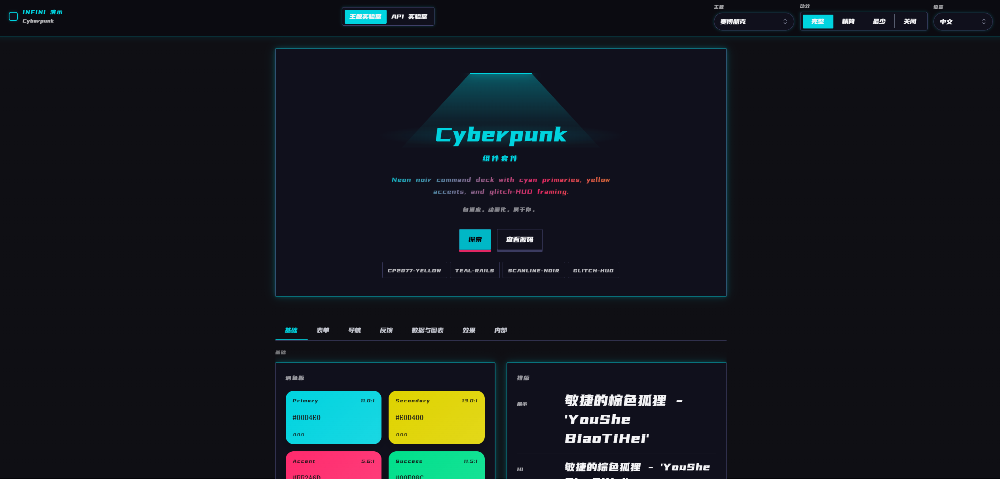
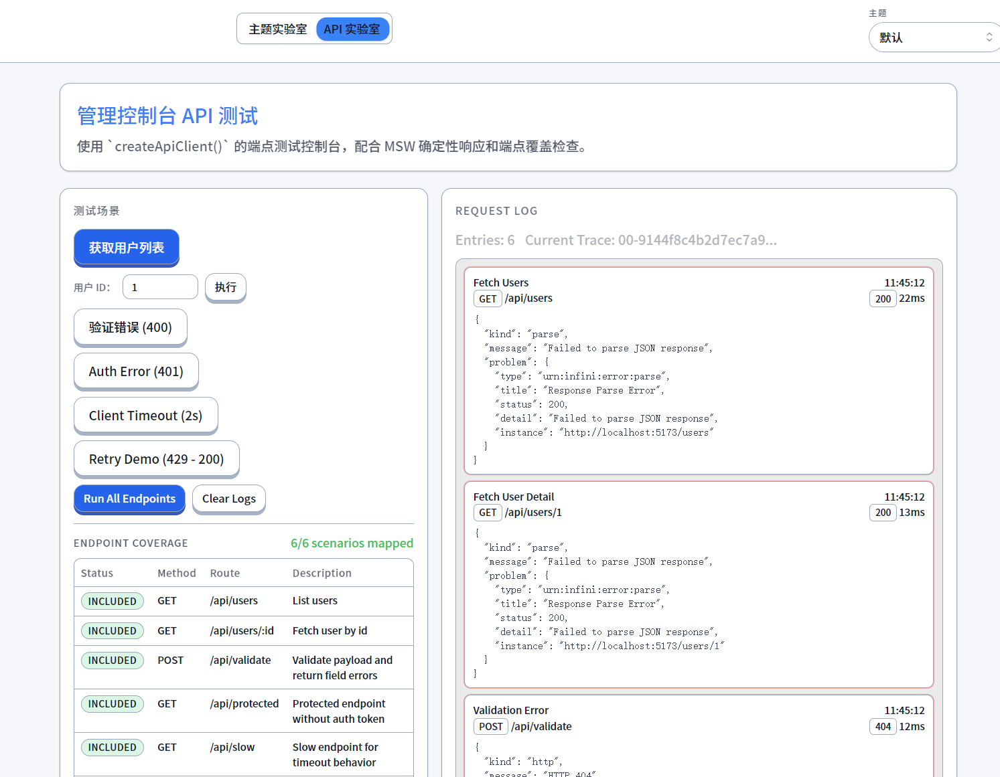

# Infini Dev Kit

[中文（默认）](./README.md) | **English**

Private pnpm workspace monorepo for the Infini ecosystem. It provides the theme core, React components, framework adapters, API client utilities, bot foundations, and shared utility modules.

Default entry document: Chinese `README.md`.

> AI agents should read [`AGENTS.md`](./AGENTS.md) first.

## Preview

The screenshots below come from the latest Chinese UI build in `Infini-Demo`:

| Theme Lab · Default | Theme Lab · Cyberpunk | API Lab |
| --- | --- | --- |
|  |  |  |

## Repository Role

`Infini-Dev-Kit` is not a single UI package. It is a reusable platform foundation:

- `packages/theme-core`
  Theme specs, theme registry, bridge/state orchestration, font loading, CSS variable generation, and motion contracts.
- `packages/adapter-*`
  `ThemeSpec` mappings for Mantine, shadcn, MUI, Ant Design, and Radix Themes.
- `packages/react`
  Shared React components, hooks, motion wrappers, and frontend-facing utilities.
- `packages/api-client`
  Reusable HTTP client and error model.
- `packages/bot-core`, `packages/bot-discord`, `packages/bot-wechat`
  Bot abstractions and platform adapters.
- `packages/utils`
  Pure helpers for color, storage, IDs, scroll handling, environment checks, and type utilities.

## Quick Start

```bash
pnpm install
pnpm typecheck
pnpm test
pnpm build
```

## Common Imports

```ts
import {
  buildScopedCssVariables,
  createThemeProviderBridge,
  getThemeSpec,
  listThemeIds,
  loadThemeFonts,
} from "@infini-dev-kit/theme-core";

import {
  applyLocaleTypography,
  buildScopedCssVariables as buildMantineScopedCssVariables,
  getThemeOverrides,
} from "@infini-dev-kit/adapter-mantine";

import {
  AnimatedTabs,
  CrystalPrismButton,
  DepthButton,
  ScrollProgress,
  SoftClayButton,
} from "@infini-dev-kit/react";

import { createApiClient } from "@infini-dev-kit/api-client";
import { createBot } from "@infini-dev-kit/bot-core";
import { contrastRatio, createBrowserLocalStorageAdapter } from "@infini-dev-kit/utils";
```

## Theme Capabilities

Built-in themes:

- `default`
- `chibi`
- `cyberpunk`
- `neu-brutalism`
- `black-gold`
- `red-gold`

Motion levels:

- `off`
- `minimum`
- `reduced`
- `full`

`theme-core` owns theme state, fonts, motion contracts, and CSS variables. Framework-specific consumption is handled by adapters or the host application.

## Package Overview

| Package | Purpose |
| --- | --- |
| `@infini-dev-kit/theme-core` | Framework-agnostic theme core, fonts, CSS variables, motion contracts |
| `@infini-dev-kit/adapter-mantine` | Mantine token mapping, scoped variables, locale typography helpers |
| `@infini-dev-kit/adapter-shadcn` | shadcn / Tailwind variable mapping |
| `@infini-dev-kit/adapter-mui` | MUI theme mapping |
| `@infini-dev-kit/adapter-antd` | Ant Design theme mapping |
| `@infini-dev-kit/adapter-radix` | Radix Themes props and overrides |
| `@infini-dev-kit/react` | React components, hooks, motion wrappers |
| `@infini-dev-kit/utils` | Pure utility modules and type helpers |
| `@infini-dev-kit/api-client` | API client and error model |
| `@infini-dev-kit/bot-core` | Core bot abstractions |
| `@infini-dev-kit/bot-discord` | Discord adapter |
| `@infini-dev-kit/bot-wechat` | Wechaty adapter |

## Workspace Layout

```text
Infini-Dev-Kit/
├── packages/
│   ├── theme-core/
│   ├── adapter-mantine/
│   ├── adapter-shadcn/
│   ├── adapter-mui/
│   ├── adapter-antd/
│   ├── adapter-radix/
│   ├── react/
│   ├── utils/
│   ├── api-client/
│   ├── bot-core/
│   ├── bot-discord/
│   └── bot-wechat/
├── docs/
├── package.json
├── pnpm-workspace.yaml
└── tsconfig.base.json
```

## Common Commands

```bash
pnpm install
pnpm typecheck
pnpm test
pnpm build
pnpm lint
```

## Related Docs

- [Quick Start](./docs/QUICK-START.md)
- [Theming](./docs/THEMING.md)
- [Internationalization](./docs/I18N.md)
- [Performance](./docs/PERFORMANCE.md)
- [Troubleshooting](./docs/TROUBLESHOOTING.md)
- [Changelog](./CHANGELOG.md)

## Rules

1. Use workspace package names as the public import surface.
2. Run `pnpm typecheck` before claiming completion.
3. Keep theme definitions data-oriented; runtime logic belongs in `theme-core`, adapters, or consumers.
4. `README.md` remains the Chinese default entry, while `README_en.md` is the English companion.

## License

[MIT](./LICENSE)
